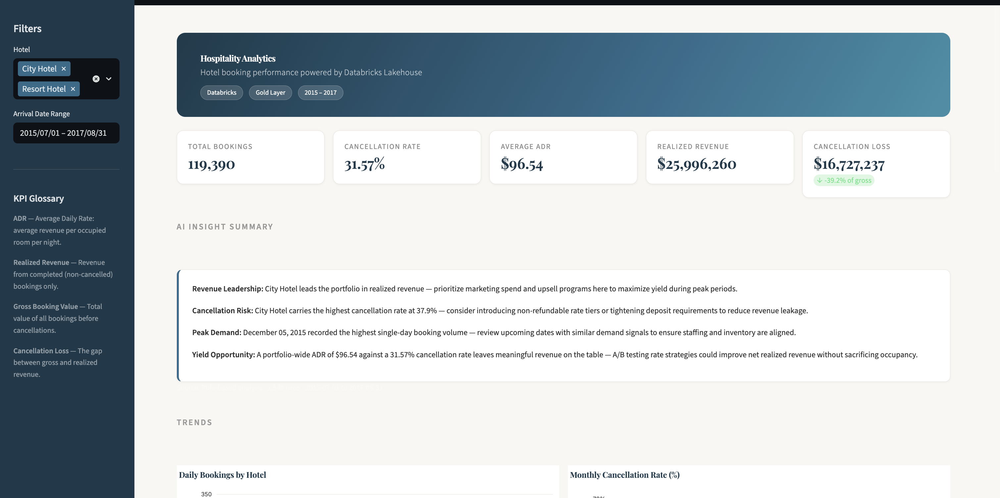
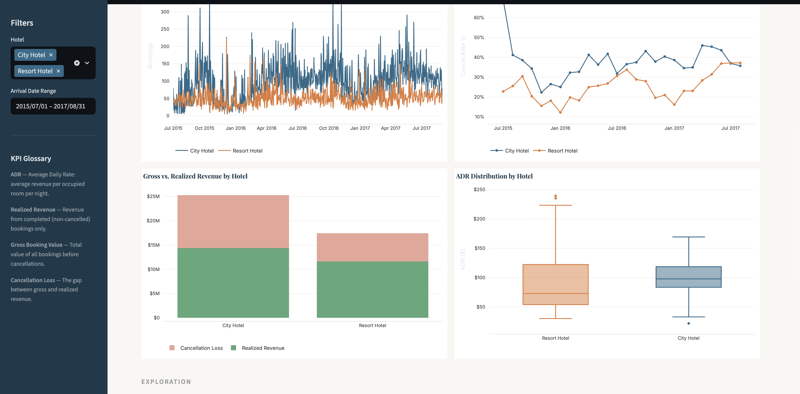
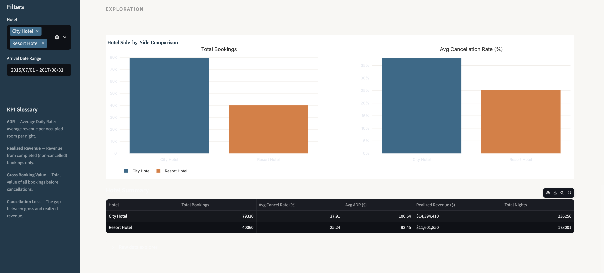

# Hospitality Analytics Lakehouse

A end-to-end data pipeline built on Databricks that ingests raw hotel booking data, transforms it through a medallion architecture, and surfaces metrics in an interactive Streamlit dashboard with AI-generated insights powered by Claude.







---

## What This Demonstrates

- **Medallion architecture** — Bronze → Silver → Gold layer design in Databricks
- **SQL transformation pipeline** — date normalization, type casting, and metric aggregation across layers
- **Lakehouse querying** — connecting a Python application directly to Databricks SQL via the connector SDK
- **AI integration** — Claude API generating dynamic, data-driven hospitality insights
- **Production patterns** — secrets management, data caching, graceful API fallback, and filter-driven state

---

## Architecture
```
┌─────────────────────────────────────────────────────────┐
│                     Data Sources                        │
│          Hotel Booking Demand Dataset (CSV)             │
└─────────────────────┬───────────────────────────────────┘
                      │
                      ▼
┌─────────────────────────────────────────────────────────┐
│                  BRONZE LAYER                           │
│             bronze_hotel_bookings                       │
│                                                         │
│  Raw ingestion — data loaded as-is from CSV source.     │
│  No transformations. Preserves original structure.      │
└─────────────────────┬───────────────────────────────────┘
                      │  Clean + structure
                      ▼
┌─────────────────────────────────────────────────────────┐
│                  SILVER LAYER                           │
│             silver_hotel_bookings                       │
│                                                         │
│  - Combines arrival_date_year / month / day columns     │
│    into a single arrival_date DATE field                │
│  - Casts and validates data types                       │
│  - Filters out malformed records                        │
└─────────────────────┬───────────────────────────────────┘
                      │  Aggregate + enrich
                      ▼
┌─────────────────────────────────────────────────────────┐
│                   GOLD LAYER                            │
│           gold_daily_hotel_metrics                      │
│                                                         │
│  Daily aggregates by hotel:                             │
│  - total_bookings / canceled_bookings                   │
│  - cancellation_rate_pct                                │
│  - total_nights_booked                                  │
│  - average_adr                                          │
│  - gross_booking_value / realized_booking_value         │
└─────────────────────┬───────────────────────────────────┘
                      │  Query via Databricks SQL connector
                      ▼
┌─────────────────────────────────────────────────────────┐
│              Streamlit Dashboard (app/app.py)           │
│                                                         │
│  - KPI cards, Plotly trend charts, hotel comparisons    │
│  - Sidebar filters (hotel, date range)                  │
│  - AI Insight Summary via Claude API                    │
└─────────────────────────────────────────────────────────┘
```

---

## Dashboard Features

| Feature | Details |
|---|---|
| KPI cards | Total bookings, cancellation rate, avg ADR, realized revenue, cancellation loss |
| Trend charts | Daily bookings, monthly cancellation rate, gross vs. realized revenue, ADR distribution |
| Hotel comparison | Side-by-side bookings and cancellation rate by property |
| AI insights | Claude-generated analysis based on live filtered data; falls back to rule-based insights if no API key is configured |
| Filters | Hotel multiselect and arrival date range — all charts and KPIs respond dynamically |
| Raw data explorer | Sortable, filterable view of the underlying Gold layer records |

---

## Dataset

The [Hotel Booking Demand dataset](https://www.kaggle.com/datasets/jessemostipak/hotel-booking-demand) contains ~119,000 reservations across two properties — a city hotel and a resort hotel — from July 2015 through August 2017. Fields include lead time, arrival date, length of stay, ADR, market segment, and cancellation status.

---

## Project Structure
```
hospitality-databricks-lakehouse/
├── app/
│   └── app.py                  # Streamlit dashboard
├── data/                       # Local sample data
├── docs/
│   ├── data_model.md
│   ├── dataset.md
│   ├── metric_definitions.md
│   ├── project_plan.md
│   ├── scaling_plan.md
│   └── silver_schema.md
├── sql/
│   ├── bronze_hotel_bookings.sql
│   ├── silver_hotel_bookings.sql
│   └── gold_daily_hotel_metrics.sql
└── README.md
```

---

## Setup

### Prerequisites

- Databricks workspace with a running SQL warehouse
- Python 3.9+
- A Databricks personal access token

### Install dependencies
```bash
pip install streamlit databricks-sql-connector pandas plotly anthropic
```

### Configure secrets

Create `.streamlit/secrets.toml` at the project root:
```toml
DATABRICKS_HOST      = "your-workspace.cloud.databricks.com"
DATABRICKS_HTTP_PATH = "/sql/1.0/warehouses/your-warehouse-id"
DATABRICKS_TOKEN     = "your-personal-access-token"

# Optional — enables Claude AI insights instead of rule-based fallback
ANTHROPIC_API_KEY    = "sk-ant-..."
```

> **Note:** `.streamlit/secrets.toml` is gitignored and should never be committed.

### Run the pipeline

Execute the SQL files in order against your Databricks workspace:
```
sql/bronze_hotel_bookings.sql
sql/silver_hotel_bookings.sql
sql/gold_daily_hotel_metrics.sql
```

### Launch the dashboard
```bash
streamlit run app/app.py
```

---

## Key Implementation Notes

**Why Gold layer only in the dashboard?**
The app queries only `gold_daily_hotel_metrics` — it's a consumer of the pipeline, not a transformer. All aggregation logic lives in SQL where it belongs, keeping the application layer thin and the data layer independently testable.

**Caching strategy**
Data is cached for one hour via `@st.cache_data(ttl=3600)`. This prevents a new Databricks connection on every user interaction while keeping the dashboard reasonably fresh for a historical dataset. A live operations use case would warrant a shorter TTL.

**AI insight fallback**
If `ANTHROPIC_API_KEY` is not set, the dashboard generates rule-based insights from the same metrics. This means the app is fully functional without an API key and upgrades transparently when one is provided.

---

## Possible Extensions

- Automate the Bronze ingestion layer with a Databricks job or Delta Live Tables
- Add a `gold_weekly_segment_metrics` table to support market segment analysis
- Extend the Silver layer to parse lead time buckets and booking channel
- Deploy to Streamlit Cloud with secrets configured as environment variables